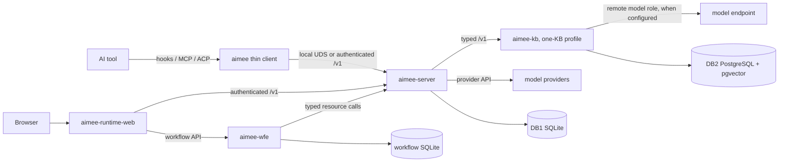
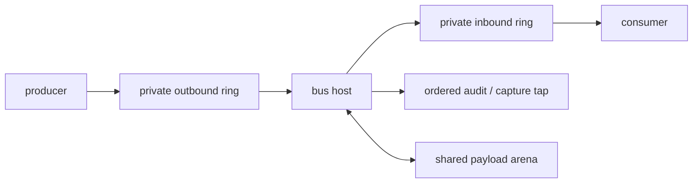

# Architecture

aimee is a local-first runtime between AI tools, model providers, code, and durable knowledge. It
keeps the fast client separate from stateful services, gives storage one owner, and sends internal
module events through one bounded bus.

## Processes

The table below describes the **current** topology, which is mid-migration. It is not the
target. aimee is moving off the C mono-application onto Go modules, and the ownership it
records, such as `aimee-server` holding provider calls and `aimee-runtime-web` serving its own HTTP,
It is what exists today, not what is being built toward. Read [the module
doctrine](#module-doctrine) for the target before using this table to decide where code
belongs.

| Process | Owns | Does not own |
| --- | --- | --- |
| `aimee` | CLI parsing, local hooks, MCP/ACP stdio, client filesystem access | databases, server policy, provider credentials |
| `aimee-server` | sessions, DB1, agents, tools, policy, vault, provider calls, `/v1` resource plane | DB2, workflow lifecycle |
| `aimee-wfe` | workflow definitions, scheduling, artifacts, retries, gates, worktrees, forge lifecycle | agent credentials, KB data, general chat |
| `aimee-kb` | DB2, memory, documents, code graph, retrieval, curation, and its internal or remote model-role placements | DB1, workflow state, another KB's corpus |
| `aimee-runtime-web` | browser auth, session proxying, UI delivery | product databases and workflow decisions |

`aimee-server` and `aimee-wfe` run as supervised peers in the server image. If either exits, the
container terminates both and fails. The C server returns `410 Gone` for retired workflow lifecycle
routes; there is one workflow writer.

The browser, KB console, and optional ambient gateway are clients. They do not bypass the service
that owns the data they display.

The diagram shows the current one-KB profile. The target topology has several KB containers. The
server selects one by corpus, authority, and capability before any embedding or synthesis role runs.
See [KB fleet and model placement](KB_FLEET.md).

## Two transports

aimee has two distinct communication layers.

### Between processes and machines

Named `/v1` HTTP routes carry client, browser, server-to-KB, and provider traffic. Local clients use
a filesystem-protected Unix socket. Remote clients use TLS plus bearer or mTLS identity and route
capabilities. The generic `/v1/rpc` endpoint is retired.

The server-to-KB boundary is typed HTTP. `aimee-server` never links libpq or sends SQL. The KB never
opens DB1.

### Inside a daemon

The event bus carries typed module events. It is not a network transport and does not replace
authenticated `/v1` calls.

## Module doctrine

This is the target the migration is moving toward. Where it disagrees with the process table
above, the doctrine is the design and the table is the current state.

C owns exactly four things:

1. the event bus, for inter- and intra-module communication;
2. mTLS, MCP, and communication with the outside world;
3. the HTTP and related APIs that expose internal information;
4. the tap for auditing and governance.

C ends up a small codebase. Everything else, meaning all logic and all state, including registries,
queues, rendezvous, provider and turn binding, and policy, lives in a Go module under
`server-go/modules/`. A concurrency primitive is not transport: a condition variable or a
FIFO is logic, and belongs in Go as channels.

Modules get no HTTP APIs. A module never binds a socket and never accepts a connection.
`runtime-web` and `control-web` are modules and get no exemption: their HTTP surface belongs
to C, while their logic stays in the module and speaks only the bus.

Direct module-to-module communication is forbidden. Every exchange between modules goes over
the event bus, so that governance and auditing see all of it.

External communication is banned from every module, with two structural doors: communication
initiated from outside arrives over the event bus through C, and communication a module
initiates leaves through the `egress` module. Direction selects the door; it never grants a
module the right to open a connection itself. Until `egress` exists, a module may make
internally-initiated outbound calls (the delegate module reaching an LLM and the git module
reaching its forge are both valid and load-bearing), but every such call must be logged to
the event bus. There is no unmonitored external communication. See [One egress
module](proposals/pending/module-egress-single-point.md).

Each daemon creates one host. Admitted clients receive a read-only control region, their own queue
pair, and the shared arena. The host owns admission, sequence numbers, subscriptions, routing,
correlations, credits, and client reap.

The current load-bearing consumer is observability:

- governed actions;
- semantic guardrail events;
- server and KB memory mutations;
- vault credential access;
- sandbox isolation degradation;
- MCP and tool-call activity;
- tool completion outcomes.

The host tap sees accepted events before routing. It writes an ordered capture stream while the
consumer drains typed records to the WORM ledger or DB1. Storage stays off the request path.

Small events are inline. Large events use generation-checked arena leases. Backpressure is bounded;
a producer blocks or receives `would_block`, and shed delivery is represented by an overflow event.
There is no unbounded host queue.

See [Event bus](EVENT_BUS.md).

## Storage

There are two product data tiers and one workflow store.

| Store | Owner | Contents |
| --- | --- | --- |
| DB1, SQLite | `aimee-server` | sessions, working memory, local state, agent jobs, policy and audit state, caches |
| Workflow SQLite | `aimee-wfe` | definitions, immutable snapshots, work items, lifecycle events, artifacts, retries and parks |
| DB2, PostgreSQL + pgvector | `aimee-kb` | durable memories, documents, facts, evidence, code graph, embeddings, curation state |

The DB1/DB2 boundary is compile-enforced:

- server builds disable DB2 and never link libpq;
- KB builds disable DB1 and never link SQLite;
- thin clients link neither;
- calls across the boundary use public typed APIs.

The WORM hash primitive is the narrow exception shared by both stores. It contains hashing only, with no
database handles or queries, so both stores produce the same chain format.

New KB containers run a private PostgreSQL 18 cluster when no external `AIMEE_DB2_URL` is set. It is
still DB2, still owned by the KB, and still independently exportable.

See [Storage tiers](STORAGE_TIERS.md).

## Request paths

### Local tool hook

1. The coding tool starts the thin client with a small JSON event.
2. The client sends it over the local Unix socket.
3. The server authenticates the socket by filesystem ownership.
4. Policy and guardrails return allow, deny, or context.
5. The action and verdict enter the event-bus audit path.

The client opens no database and starts no daemon. Warm state stays in `aimee-server`.

### Remote thin client

1. `remote.conf` resolves the server URL, certificate pin, bearer, and client identity.
2. Native TLS verifies the endpoint.
3. The server maps the principal to route capabilities and a write tier.
4. Read operations dispatch normally. A write also needs a KB-signed identity token, matching
   server/team trust, and the user's grant.
5. Workspace and document commands upload bytes from the client; the server never resolves a path
   on the client's machine.

### Memory write and recall

1. A client calls the server `/v1` surface.
2. The server authorizes the principal and calls the KB's typed endpoint.
3. The KB owns the transaction, lexical/dense indexes, and evidence.
4. Mutations publish a PII-safe audit identity on the KB bus.
5. Recall returns bounded evidence; optional synthesis runs inside the selected KB container or at
   that KB's configured remote endpoint.

### Delegate turn

1. The server admits a role/persona request against agent limits, budget, policy, and credentials.
2. The workspace authority selects a local, remote-runner, or isolated-container backend.
3. Provider requests become canonical IR, then one provider translation at the edge.
4. Tool calls pass schema, policy, worktree, and sandbox checks.
5. Tool activity and outcomes publish to the event bus.
6. The server returns a compact result and preserves the durable job, cost, and audit record.

### Workflow run

1. **Admit immutable input.** `aimee-wfe` validates and snapshots the definition and request.
2. **Persist before dispatch.** The scheduler writes the transition before starting work.
3. **Cross a typed resource boundary.** Agent and roundtable work calls the C server; credentials never cross
   back into the workflow store.
4. **Confine each slice.** Every child gets its own worktree and branch.
5. **Keep evidence separate.** Verification, review, merge, and forge operations produce distinct artifacts.
6. **Stop at human authority.** A human gate parks until a browser or API decision arrives. The service stores
   a hashed approval artifact and lifecycle event, not a cryptographic principal signature. A crash
   resumes from the durable event log.

## Trust boundaries

The important boundaries are:

- **local user to local socket:** filesystem permissions are the identity;
- **remote client to server:** TLS, certificate pinning, bearer/mTLS identity, route capabilities,
  and write grants;
- **browser to server:** browser login, CSRF protection, principal propagation, and the same server
  authorization;
- **server to KB:** service bearer/TLS plus typed APIs;
- **workflow to resource plane:** local attested peer plus narrow internal operations;
- **agent to workspace:** assigned worktree and path policy;
- **delegate to host:** container/process sandbox, no ambient credentials, explicit egress;
- **service to provider:** vault resolution, provider allowlist, budget, rate, and egress policy;
- **module to bus:** admission, per-client rings, authorized event kinds, bounded flow control.

An admitted native bus module is trusted code. The shared arena is cooperative isolation, not a
sandbox. An external WORM witness is required if the threat includes full host compromise.

See [Security](SECURITY.md).

## Deployment shapes

| Shape | Use | Tradeoff |
| --- | --- | --- |
| Managed server | One server container launches one KB profile from the browser | Needs the host Docker socket |
| Split stack | Separate server and one KB profile | More explicit; no server Docker control required |
| KB fleet | Several capability-declaring KB containers | Target routing path; not integrated in this checkout |
| External DB2 | KB uses managed PostgreSQL | Operator owns backup, TLS, extensions, and latency |
| Local source install | Development and debugging | Host owns dependencies and services |
| Thin client | Normal developer machine | Needs a reachable server; keeps state off the client |

The old combined appliance image is gone.

## Code boundaries

- `src/core/event_bus/`: event transport, arena, host, client, capture.
- `src/modules/`: owned C modules and public headers.
- `src/server/`: C resource plane and `/v1` handlers.
- `src/kb/`: KB daemon and DB2-facing routes.
- `server-go/`: workflow control plane and pure-Go bus client.
- `runtime-web/`: browser-facing Go service.
- `frontend/`: browser application.
- `api/`: OpenAPI sources and generated SDKs.

[Technical reference](../src/README.md) covers build targets, linkage, tests, and source ownership.
